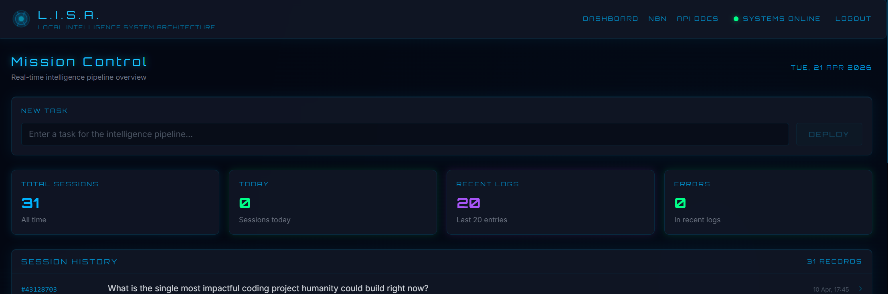
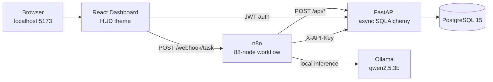
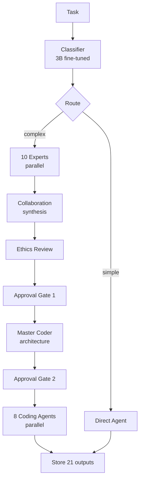
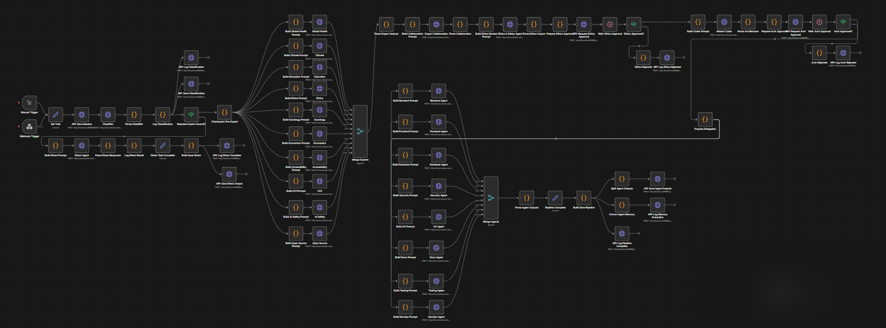
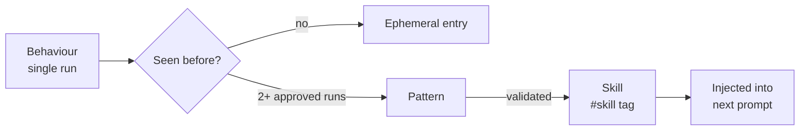

# LISA — Local Intelligence System Architecture

> A fully-local multi-agent AI system running on a single PC. Zero cloud, zero telemetry, zero API bills.

  



LISA orchestrates **21 specialist agents** — a 10-expert council, an ethics reviewer, a master coder, and 8 coding specialists — to analyse a problem, approve an approach, and deliver a design. All inference runs on a local 3B model (Ollama · `qwen2.5:3b`). Nothing leaves the machine.

---

## Why this exists

- **Small models + structure beat frontier models used naively.** A 3B model with a 10-expert council, ethics gate, and architect review produces better project designs than the same model asked once.
- **Workflow-as-code.** The entire 88-node n8n pipeline is generated from one JavaScript file — diffable, reviewable, reproducible.
- **Agents that learn between runs.** Each agent owns a plaintext `memory.md` file. Patterns that recur get promoted to skills. No retraining, no embeddings, no black box. See [docs/showcase/memory-system.md](docs/showcase/memory-system.md).

---

## Architecture



Every port is bound to `127.0.0.1`. Nothing exposed externally. Runs entirely on the host.

---

## Run it in three commands

```bash
cp .env.example .env              # fill in secrets (instructions in the file)
docker compose up -d              # postgres, n8n, backend, frontend, pgadmin
ollama pull qwen2.5:3b            # the reasoning model (~2 GiB)
```

Open `http://localhost:5173`, log in, submit a task. The full pipeline runs in ~8–10 minutes on a 6-core CPU with no GPU.

---

## The pipeline



Two human approval gates — ethics and architecture — always pause the pipeline. The dashboard surfaces context for each gate with approve/reject buttons. Nothing executes without consent.

<details>
<summary><b>Full n8n workflow (88 nodes)</b></summary>



</details>

---

## Example run

A single task — *"Design an open-source platform for tracking climate research across institutions"* — produced **21 structured outputs** in ~9 minutes at $0 inference cost:

- **10 expert perspectives** (climate, global health, education, ethics, sociology, economics, accessibility, HCI, AI safety, open source)
- **1 collaboration synthesis** merging the council into a cohesive proposal
- **1 ethics review** flagging risks (data sovereignty, institutional bias)
- **1 architecture brief** from the master coder (stack, services, data model)
- **8 coding specialist designs** (backend API, frontend, database schema, security, UX, docs, tests, DevOps)

Each output is tagged, dated, and saved to Postgres. Each specialist agent also appends a tagged entry to its own `memory.md`, so subsequent runs on similar topics inherit the learned patterns.

---

## Agent memory — the novel bit

Each of the 18 reasoning agents + the master coder + the ethics reviewer owns a markdown memory file. Before inference, the 5 most-recent entries are injected into the system prompt. After the pipeline completes, a memory-extraction node appends new entries with tags.



Tag hierarchy: `#behaviour/coding`, `#topic/climate_research`, `#confidence/high`, `#uses/3`, `#skill`. Grep-able, human-readable, version-controllable.

**Why not vector embeddings?** Debuggability beats recall at this scale. Opening `memory.md` in a text editor answers "what did the agent know?" in two seconds. Full reasoning: [docs/showcase/memory-system.md](docs/showcase/memory-system.md).

---

## Tech stack

| Layer | Technology | Why |
|---|---|---|
| Orchestration | n8n 2.14 | Workflow-as-code, 88-node pipeline generated from one JS file |
| LLM | Ollama · `qwen2.5:3b` Q4_K_M | Clean JSON output, fits 6 GiB RAM, runs on CPU |
| Classifier | `thp-classifier` 3B (fine-tuned) | Fast task routing |
| Backend | FastAPI + async SQLAlchemy | Non-blocking I/O for parallel agent calls |
| Frontend | React + Vite, native `fetch` | No axios (supply-chain risk), Iron Man HUD theme |
| Database | PostgreSQL 15 | Full pipeline persistence (sessions, outputs, logs, approvals) |
| Auth | JWT (frontend) + X-API-Key (n8n) | Every endpoint protected |
| Infra | Docker Compose | 5 services, all bound to 127.0.0.1 |

---

## Known limitations

- **CPU-bound.** A full run is ~8–10 minutes on a 6-core machine. A GPU would cut this to under two minutes.
- **6 GiB Ollama ceiling.** `qwen2.5:3b` Q4_K_M was chosen deliberately — larger models (e.g. `qwen3.5:9.7b`) OOM on this hardware.
- **Single-user.** JWT auth exists, but the dashboard assumes one operator. No RBAC yet.
- **Folder typo.** The repo is currently `LOCAL_INTELIGENCE_SYSTEM` (missing the second *l*). Rename to `LOCAL_INTELLIGENCE_SYSTEM_ARCHITECTURE` is scheduled after Phase 2 closes — moving it now would break the Docker bind mounts mid-run.

---

## Roadmap

| Phase | Name | Status |
|---|---|---|
| 1 | Core pipeline — one LIS that thinks end-to-end | ✅ Complete (`v0.1.0`) |
| 2 | Hardening — auth, approval gates, persistence, memory | 🔧 In progress |
| 3 | OpenClaw — multiple specialised LIS instances under one orchestrator | Planned |
| 4 | Tool layer — agents can search, read, write, and act (with approval) | Planned |
| 5 | Self-learning — pattern mining, skill promotion, cross-instance knowledge | Planned |

---

## License

MIT — see [LICENSE](LICENSE).

Built by **Jack Tyson**. Questions, ideas, or critique welcome via GitHub issues.

---

> *"Everybody is a genius. But if you judge a fish by its ability to climb a tree, it will live its whole life believing that it is stupid."* — Albert Einstein
