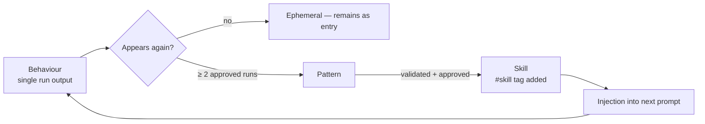

# Memory system

> How LISA's agents learn between runs, without retraining the model.

Every LISA agent — 10 expert-council members, 8 coding specialists, the ethics reviewer, the master coder — owns a plaintext `memory.md` file. Before inference, relevant entries are injected into the system prompt. After the pipeline completes, a memory-extraction node writes new tagged entries back. Over many runs, each agent accumulates domain knowledge that survives restarts, survives model swaps, and is human-readable.

No vector database. No embedding recomputation. No opaque state. Just markdown files, grep-able tags, and small code nodes inside n8n.

---

## The tag hierarchy

Inspired by Obsidian's nested tag system:

| Tag family | Purpose | Example values |
|---|---|---|
| `#behaviour/*` | What the agent was doing | `coding`, `analysis`, `ethics_review`, `architecture` |
| `#topic/*` | Domain of the task | `web_development`, `climate_research`, `security`, `general` |
| `#confidence/*` | Self-reported quality | `low`, `medium`, `high` |
| `#uses/N` | Integer — incremented on reuse | `#uses/3` |
| `#skill` | Present when a pattern has been promoted | (flag) |

A memory entry looks like this:

```markdown
---
## 2026-04-10 | Design REST endpoints for climate data CRUD with JWT auth
tags: #behaviour/coding #topic/climate_research #confidence/medium #uses/1
- Use async SQLAlchemy sessions for all database operations.
- Prefer Pydantic BaseModel for request/response validation.
- Keep route handlers thin; business logic lives in services.
- Don't scatter role checks — use a dependency injection guard.
---
```

Every entry is date-headed, tagged, and separated by `---`. The format is Obsidian-native and GitHub-native: browse the same vault in an IDE, in Obsidian for the graph view, or in the LISA dashboard.

---

## The lifecycle



**Behaviour** — a single output from one pipeline run. Written as an entry with `#uses/1`.

**Pattern** — a behaviour that has recurred. When extraction detects an entry with matching `#behaviour` + `#topic` already exists, it increments `#uses/N` instead of writing a duplicate.

**Skill** — a pattern that has survived at least one approval gate twice. The extraction node adds `#skill` and this entry is prioritised in future injections.

The promotion rule is simple enough to reason about and audit by reading a markdown file. No training loop, no model update, no black box.

---

## Injection — reading memory before inference

Every agent's prompt-building Code node in n8n reads its own memory file. Here is the coding agent template (generated by `scripts/generate_workflow.js` for each of the 8 coding agents):

```javascript
var prep = $('Prepare Delegation').first().json;
var task = prep.delegation.backend_agent || "No specific task assigned.";

// Memory injection — read learned patterns from agent memory
var agentMemory = "";
try {
  var fs = require("fs");
  var memPath = "/home/node/.n8n-files/agents/coding_agents/backend_agent/memory.md";
  if (fs.existsSync(memPath)) {
    var content = fs.readFileSync(memPath, "utf8");
    var entries = content.split("\n---\n").filter(function(e) {
      return e.indexOf("## ") !== -1 && e.indexOf("tags:") !== -1;
    });
    if (entries.length > 0) agentMemory = entries.slice(-5).join("\n---\n");
  }
} catch(e) { /* memory read failed, continue without */ }

var sysPrompt = "Python/FastAPI engineer. Stack: FastAPI + PostgreSQL + Docker. …";
if (agentMemory) {
  sysPrompt = sysPrompt + "\n\nAgent Memory (learned skills):\n" + agentMemory;
}

return [{ json: {
  model: "qwen2.5:3b",
  stream: false,
  options: { temperature: 0.2, num_predict: 1024, num_thread: 6 },
  messages: [
    { role: "system", content: sysPrompt },
    { role: "user", content: "Project: " + prep.project_name + "\nYour task: " + task }
  ]
}}];
```

Three design choices:

- **`slice(-5)` — inject the five most recent entries.** Small 3B models have limited context and attention; more than five and the injection starts competing with the task itself. Tunable.
- **Wrapped in try/catch.** Memory is non-critical — if fs access fails, the agent runs with its baseline prompt and the pipeline continues. No pipeline crash for a memory read error.
- **Tag filtering happens client-side in JS**, not via embeddings. The file is small (tens of KB), the parse is microseconds, and the filter is explicit enough to audit.

---

## Extraction — writing memory after the run

A single `Extract Agent Memory` Code node runs after the pipeline completes in parallel with the output-saving branch. It reads every agent's output, derives tags from the classification, and appends entries:

```javascript
var fs = require("fs");
var basePath = "/home/node/.n8n-files/agents";
var timestamp = new Date().toISOString().substring(0, 10);
var taskShort = $('Set Task').first().json.task.substring(0, 80);

var classData = $('Parse Classifier').first().json;
var domain = String(classData.classification.category || "general")
  .toLowerCase()
  .replace(/[^a-z0-9]+/g, "_");

// Example: extract for each of the 8 coding agents
var agentOutputs = $('Parse Agent Outputs').first().json.agent_outputs || [];
for (var i = 0; i < agentOutputs.length; i++) {
  var ao = agentOutputs[i];
  if (ao.status !== "ok" || !ao.raw_output || ao.raw_output.length < 50) continue;

  var memPath = basePath + "/coding_agents/" + ao.agent + "/memory.md";
  var summary = ao.raw_output.substring(0, 400);
  var entry =
    "\n---\n## " + timestamp + " | " + taskShort + "\n" +
    "tags: #behaviour/coding #topic/" + domain + " #confidence/medium #uses/1\n" +
    summary + "\n";

  try { fs.appendFileSync(memPath, entry); } catch(e) {}
}
```

The full extraction node (not shown) also writes entries for the 10 experts, the ethics reviewer, and the master coder — 20 memory writes per run, one per agent that produced valid output.

---

## Why not embeddings?

Vector search would be the default move. Three reasons LISA doesn't use it (yet):

1. **Debuggability beats recall.** When an agent produces a weird output, the first question is "what did its memory contain?" Opening `memory.md` in a text editor answers that in two seconds. Querying a vector store for "top-K near this task" is ten times the operational complexity.
2. **Tags are explicit signals.** `#confidence/low` is more useful than "this entry has cosine similarity 0.82". The model writes its own confidence — you're using its self-assessment, not guessing from the embedding.
3. **Small working sets don't need embeddings.** Each `memory.md` stays under ~100 entries; reading and filtering the whole thing is cheap. When memories grow big enough to need vector search, switching in an embedding pass is a local change to the injection node.

---

## Filesystem layout

```
agents/
├── coding_agents/
│   ├── backend_agent/memory.md
│   ├── frontend_agent/memory.md
│   ├── database_agent/memory.md
│   ├── security_agent/memory.md
│   ├── ux_agent/memory.md
│   ├── docs_agent/memory.md
│   ├── testing_agent/memory.md
│   └── devops_agent/memory.md
├── expert_council/
│   ├── global_health/memory.md
│   ├── climate/memory.md
│   ├── education/memory.md
│   ├── ethics/memory.md
│   ├── sociology/memory.md
│   ├── economics/memory.md
│   ├── accessibility/memory.md
│   ├── hci/memory.md
│   ├── ai_safety/memory.md
│   └── open_source/memory.md
├── ethics_safety_agent/memory.md
└── master_coder/memory.md
```

The same folder is mounted into the n8n container (read-write) and opened in Obsidian as a vault — giving a graph view of every connection between agents, memories, and tasks for free.

---

## Configuration

n8n Code nodes need Node.js built-in modules enabled in `docker-compose.yml`:

```yaml
environment:
  N8N_FILESYSTEM_ALLOW_LIST: /home/node/.n8n-files
  NODE_FUNCTION_ALLOW_BUILTIN: fs,path
volumes:
  - ./agents:/home/node/.n8n-files/agents   # read-write for memory writes
```

That's the whole infrastructure requirement. No extra services, no extra ports, no network calls.

---

## Phase-5 roadmap (self-learning)

This memory system is the substrate for Phase 5. Three extensions planned:

- **Pattern miner** — a scheduled job that scans each `memory.md`, groups entries with matching `#behaviour`+`#topic`, and emits `#skill` tags when a pattern recurs with `#confidence/high` across multiple approved runs.
- **Cross-instance sharing** — in Phase 3 (OpenClaw) the system runs multiple LIS pipelines. Memories are shared across a common Postgres; a coding agent benefits from patterns learned by a research agent on the same topic.
- **Behaviour deprecation** — entries with `#confidence/low` that have never been reused get pruned after N runs. Keeps memories lean without human curation.

---

*Questions or ideas welcome — this is a live system, not a paper.*
